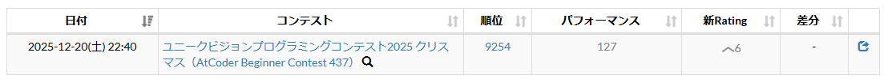
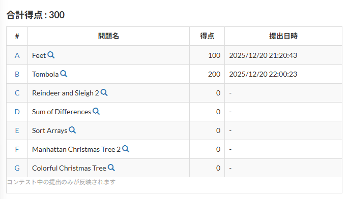
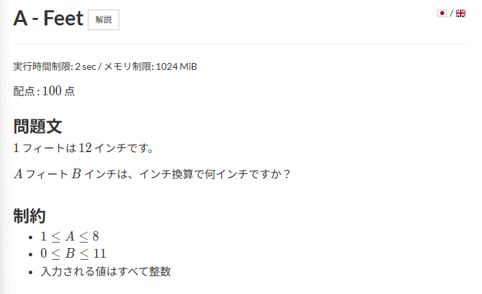
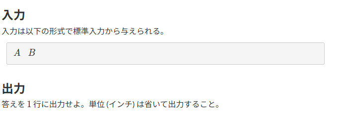
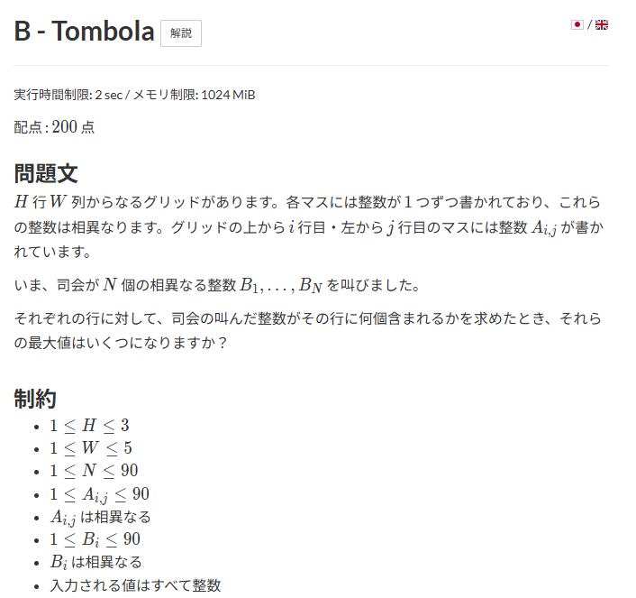
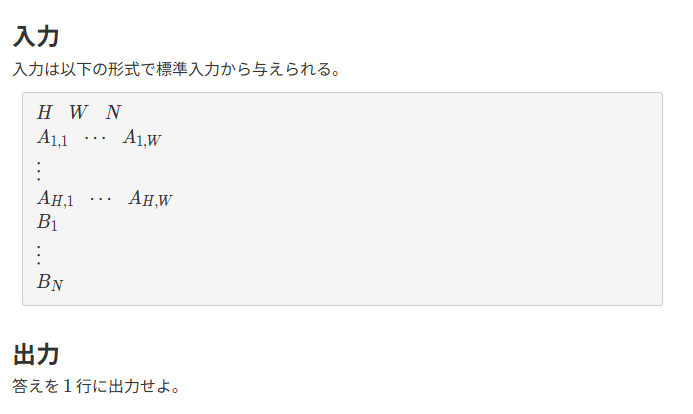
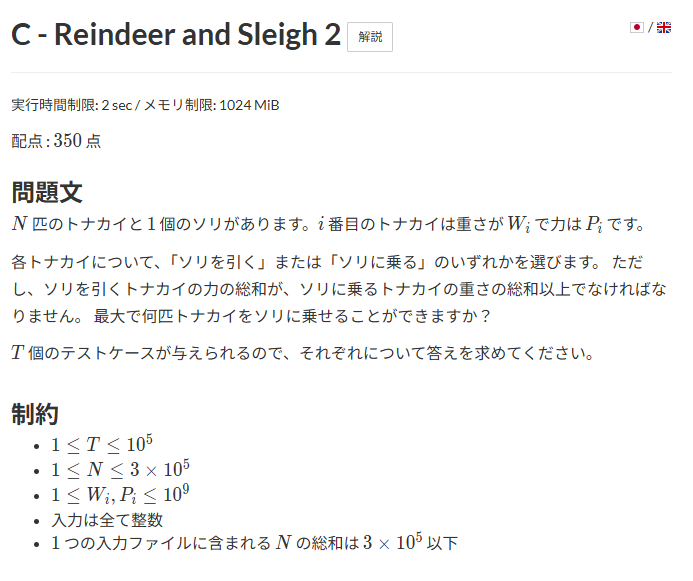
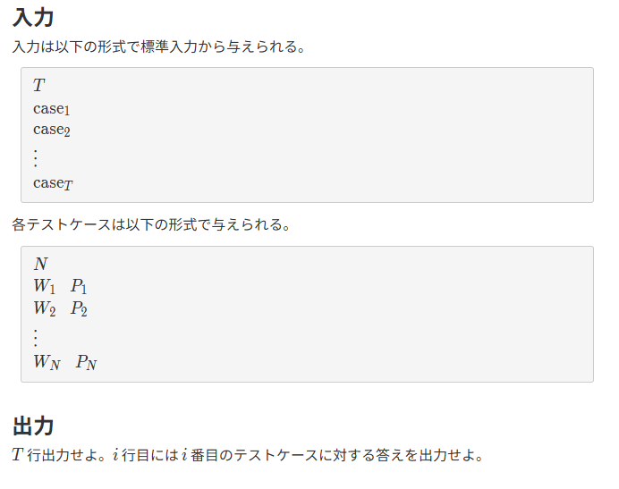

# AtCoder Begineers Contest 12/21　振り返り
## 目次
・大会概要・結果 \
・全体の振り返り \
・A問題 \
・B問題 \
・C問題 \
・コードレビュー \
・次回に向けて 

## 大会概要・結果
ユニークビジョンプログラミングコンテスト2025 クリスマス（AtCoder Beginner Contest 437) https://atcoder.jp/contests/abc437 \
使用言語:C \
大会成績:



## 全体の振り返り
今回初のAtCoderコンテスト参加。当初の目的だったA・B問題の正解を達成できて満足。ただ、呑気に夕食を食べていたら15分遅れて参加することになったためそれによる失点は次回への反省点。
## A問題
### 問題概要


### 提出コード
```C
#include <stdio.h>

int main(void) {
  int A, B, answer;
  scanf("%d", &A);
  scanf("%d", &B);
  answer = 12 * A + B;
  printf("%d", answer);
  return 0;
}

```
## B問題
### 問題概要 


### 提出コード
```C
#include <stdio.h>

int maxValue(int array[], int n) {
  int max;
  max = array[0];
  for (int i = 0; i < n; i++) {
    if (array[i] > max) {
      max = array[i];
    }
  }
  return max;
}

int main(void) {
  int h, w, n;
  int count_buffer[3] = {0};
  int answer;
  scanf("%d", &h);
  scanf("%d", &w);
  scanf("%d", &n);

  int A[3][5];
  int B[90];
  for (int j = 0; j < h; j++) {
    for (int i = 0; i < w; i++) {
      scanf("%d", &A[j][i]);
    }
  }

  for (int i = 0; i < n; i++) {
    scanf("%d", &B[i]);
  }

  for (int j = 0; j < h; j++) {
    for (int i = 0; i < w; i++) {
      for (int k = 0; k < n; k++) {
        if (A[j][i] == B[k]) {
          count_buffer[j]++;
        }
      }
    }
  }
  answer = maxValue(count_buffer, h);
  printf("%d", answer);
  return 0;
}

```
## C問題 
### 問題概要


### 提出コード
提出無し
## コードレビュー 
### A問題
A問題に関しては、C++でもCでも大してコーディングの速度は変わらないように感じる。\
簡単な問題なのでケアレスミスにだけは注意。A問題で5分のペナルティを食らうのはあまりにももったいない。
### B問題

## 次回に向けて
ひとまずは今回と同じくA・B問題の正解を目的として毎週ABCに参加しようと思う。 \
そして、土曜日だけは夕食を早めにとって予定をしっかりと開けておくようにしようと思う。
